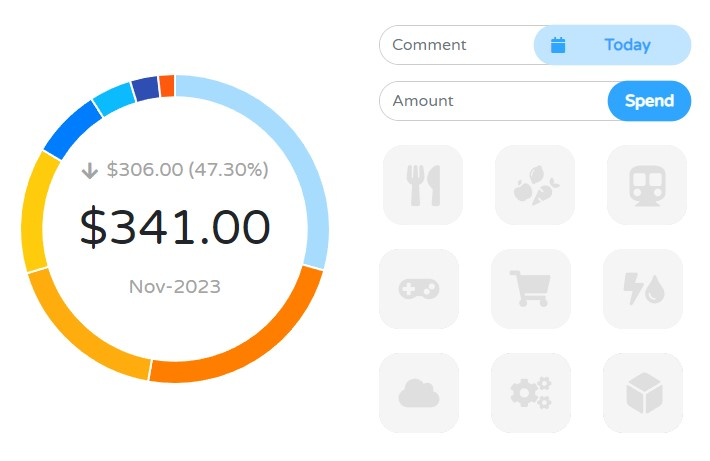
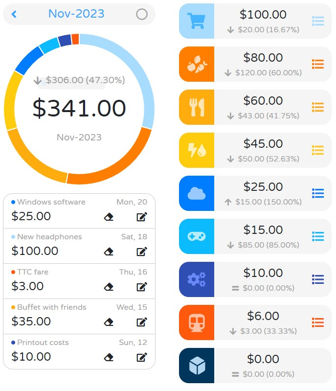
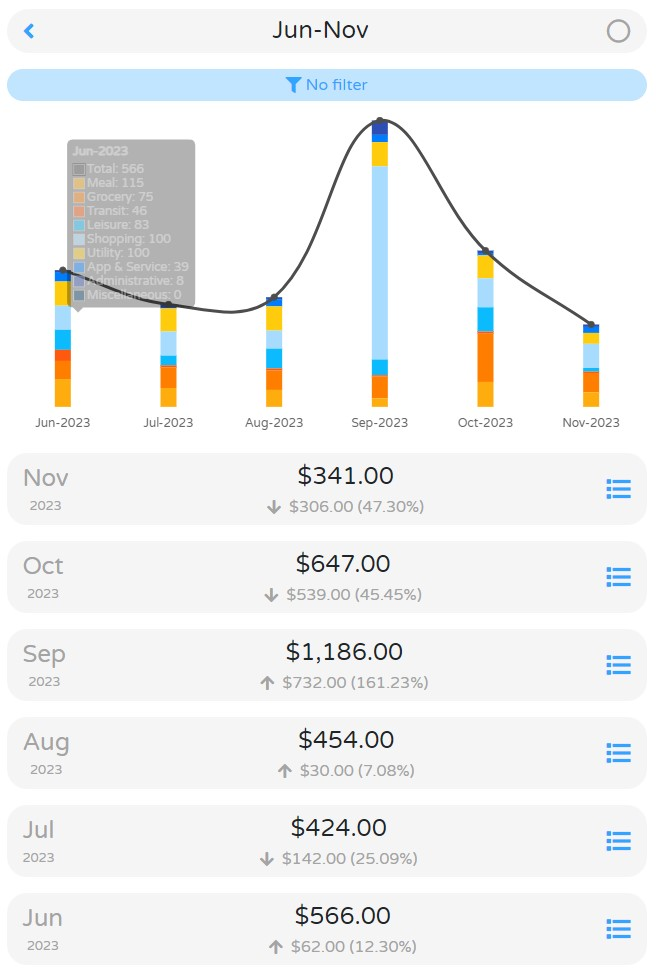

# Expense Tracker

A personal expense tracking web app developed with [React.js](https://react.dev/), PHP, MySQL, and [Chart.js](https://www.chartjs.org/)

## Quick Start

This web app can be deployed locally with [Docker](https://www.docker.com/products/docker-desktop). With Docker engine running, run the following Docker CLI command in the project directory:

  `docker-compose up --build -d`

The web app is listening on port 8000: [localhost:8000](http://localhost:8000)

## Manual Deploy

Though deploying with Docker is recommended, this project can also be deployed manually. 

1. Setup Apache HTTP Server, PHP, and MySQL
2. Setup the MySQL database by running `./db/init.sql`
3. Copy the following directories and file to `/var/www/html`

   * `/css`
   * `/js`
   * `/handler`
   * `/img`
   * `/index.html`

## Interface

The web app consists of three views/tabs: record entry view, monthly detail view, and expense history summary view. View can be selected with the bottom navigation bar. All views have responsive layouts.

### Record Entry View (Main view)

This is the main view of the app. Users can record their expenses by entering the comment, date, amount, and choosing an expense category ('Meal', 'Grocery', 'Transit', 'Leisure', 'Shopping', 'Utility', 'App & Service', 'Administrative', 'Miscellaneous'). Users can also gain insights on the total monthly spending and category breakdown shown in the graph (graph only shows on wider viewports).




### Monthly Detail View

In this view, users can see more details on the monthly spending of the selected month. Expense records can be deleted or modified. In wide viewports, the most recent 5 expenses are shown under the doughnut chart. 



### Expense History Summary View

In this view, users can see a graph showing monthly spending trends. Filters can be applied to see trends of specific categories. 




## Modification 

Refer to [React.js](https://react.dev/) and [Chart.js](https://www.chartjs.org/) for library documentations.

Setup [npm](https://www.npmjs.com/), run `npm install` to install dependencies, run `npm run build` after changes are made to the frontend code.

After any modification to the web app, the container needs to be re-built:
  1. First, stop and remove the previous expense-tracker project from Docker
  2. Run `docker-compose up --build -d`

By default, access to the MySQL database is exposed at port 81; this can be disabled by removing the following section from `docker-compose.yml`:
  ```
      ports:
        - '81:3306'
  ```
Remember to rebuild the Docker project after this change.

## License 

This project is licensed under the MIT License - see the [LICENSE](LICENSE) file for details.
